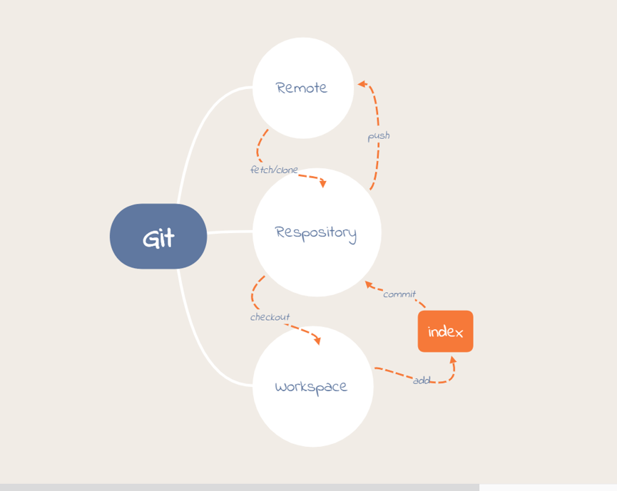
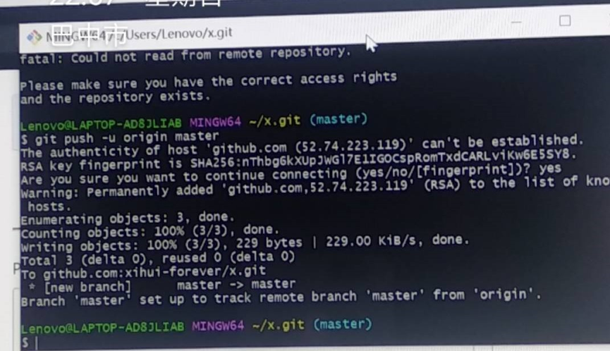

<h1 align="center">Git</h1>

<h4 align="end">BY 袁希</h4>

# 一、 开源分布式版本控制系统 
> Git --- The stupid content tracker, 傻瓜内容跟踪器。

- ① 开源：公开；
- ② 分布式：没有“中央服务器”，不必联网，每个人的电脑上都是一个完整的版本库；
- ③ 版本控制：能记录每次文件的改动情况，自动管理多个版本；

优点：管理、跟踪文件，利于协作编辑——— GitHub (个人、协作）

**【为开源项目免费提供 Git 存储】**

- 1、使用git,每次提交或保存项目状态时，git拍下当时文件的图片并存储对快照的引用；
- 2、浏览项目的历史记录，git不需要走到服务器来获取历史记录来显示，只需直接从本地数据库中读取它即可；
- 3、可以在一个月前查找文件并进行本地差异计算，不必要求远程服务器执行此操作或从远程服务器提取文件的较低版本以在本地进行

# 二、
- `Workspace`: 工作区；
- `Remote`: 远程仓库；
- `Respository`: 所有的版本信息、分支和标记信息；
- `Branches`: 独立的、拥有自己历史信息的代码

**【每个人都有自己的分支，互不打扰】**
- `Tags`: 某个分支、某个特定时间点的状态；
- `Commit`: 提交会创建一个新的版本；
- `Revision`: `SHA-1 hash` 算法表示的 `id` 来表示不同的版本

下图为我创建的思维导图：表示内部联系和相应的基本命令---



# 三、
## 搞清楚了Git是怎么回事还不够，实操需要似乎是一种语言的东西-命令行
``` bash
  $git config --global user.name "your name"     # 让Git知道你是谁
  $git config –global user.email "your email"    # 让Git知道你是谁
  $mkdir                          # mkdir 中文意思就是创建新子目录
  $pwd                            # 显示当前目录
  $git commit -m "..."            # 本次提交的说明
  $ssh-keygen -t rsa -C youremail@example.com    # ssh密钥
  $git clone git@***              # 克隆到本地仓库
  $git push origin master         # 本地提交后推送至远程仓库
```
除这些之外，还有很多很多的命令行
下图为 我操作 `git` 把本地库推送至远程库的 `git bash`
      
由此可见，命令行的使用很重要（ps:学好英语也很重要）


