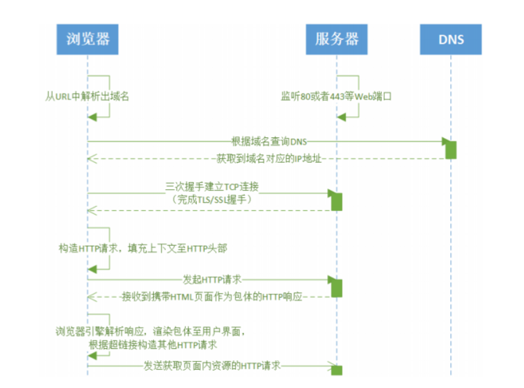
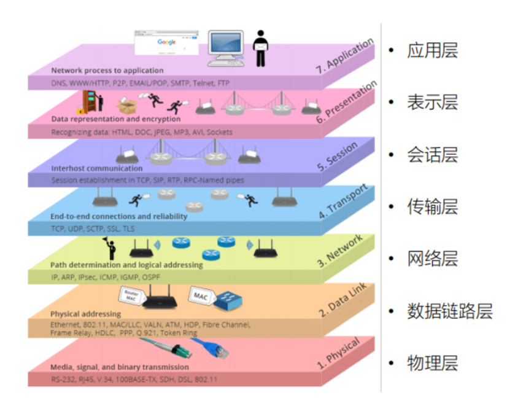
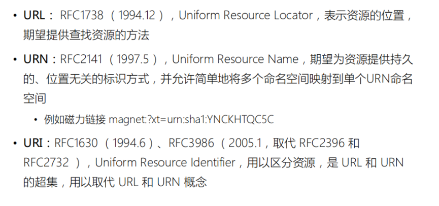
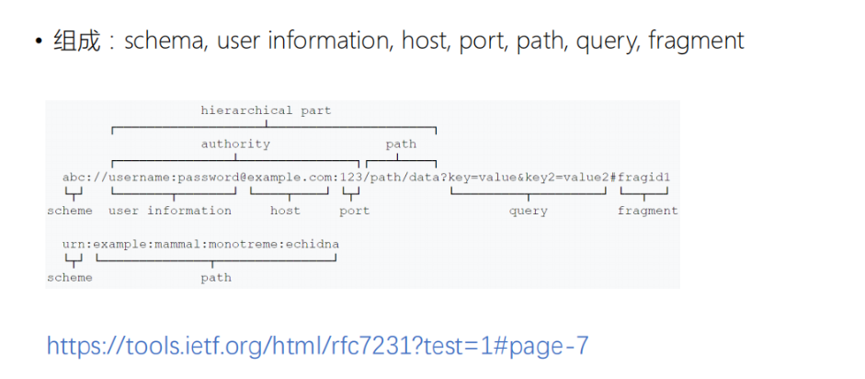

# HTTP协议

## 一、http协议：
- 1.简单-响应协议
- 2.超文本传输协议
- 3.应用层协议
- 4.无状态协议
- 5.面向对象协议

作用：规定 `www` 服务器与浏览器之间信息传递规范。

### 1. 它通常运行在TCP之上

它指定了客户端可能发送给服务器什么样的消息以及得到什么样的响应

  - 服务器端实现程序：`httpd`、`ngnix`...
  - 客户端实现程序：`web 浏览器`

建立连接——提出请求——接受并根据请求返回相应的文件（应答块模式）——关闭连接

### 2. 超文本传输协议：

 
- 消息 = `head`(`ASCII`) + `content`(`MIME`)
- 数据 = `数据包` + `数据包` + … + `数据包`（包括数据和控制信息）

9种请求方法：规定了客户和服务器（`HTML` 文件和`HTTP` 驻留程序）之间不同的信息交换方式。

### 3.应用层协议：

OSI七层概念模型：

 
- 应用层：负责解决业务问题

### 4 无状态协议：服务器不保留与客户交易的任何状态
### 5 面向对象协议：允许传送任意类型的数据对象
  - 数据类型 = 数据类型；
  - 数据长度 = 数据大小

## 二、

### 1.服务器端与客户端连接一次即断开——保证服务器与更多客户端建立连接，提高服务器效率；

### 2.无状态---服务器不保留与客户交易的任何状态，减轻服务器的记忆压力。

## 三、
- 简单：用户代理(`UA`)和源服务器(`O`)之间通过一个单独的连接来完成；
- 复杂：一个或多个中介出现在请求/响应链中。【代理（`URI` 的绝对格式来接受请求）、网关、通道】

## 四、URI：

 
 

